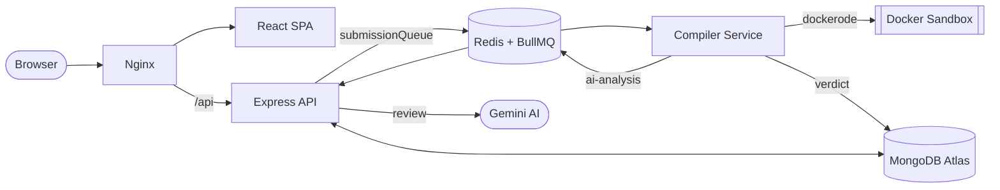

<div align="center">

# ⌁ JudgeX

**An AI-assisted online judge — write code in the browser, run it in a sandbox, get an instant verdict and an AI review.**

[](http://judgex.online)
&nbsp;


</div>

```console
$ judgex submit two-sum.cpp --lang cpp
→ queued · compiling in gcc:14 sandbox…
→ running testcases  [▇▇] 2/2
» AC  accepted · 2/2 · 871ms · 5.2mb
→ ai review · O(n) · hashing
```

---

## ✦ Features

- **5 languages** — C, C++, Java, Python, JavaScript, each run in its own image.
- **Sandboxed judging** — every submission compiles and runs in an isolated Docker container (memory-capped, 1 CPU, **no network**).
- **Real verdicts** — `AC` · `WA` · `TLE` · `RE` · `CE`, measured on hidden test cases with execution time & memory.
- **AI code review** — Google Gemini reads your accepted solution and returns a summary, complexity, and optimization hints.
- **Live results** — verdicts update in place, Codeforces-style, while the judge works.
- **The rest** — JWT auth, problem set (Easy → Hard), global leaderboard, profiles, submission history, and Swagger API docs.

---

## ✦ Architecture

A **three-service** design glued by a Redis queue — the code executor is fully **decoupled** from the API so untrusted code stays isolated and can scale on its own.



```
judgex/
├── frontend/   →  React + Vite SPA (Tailwind, Monaco editor)
├── backend/    →  Express API + JWT auth + AI worker
├── compiler/   →  the judge — sandboxed Docker execution (5 languages)
└── docker-compose.yml
```

---

## ✦ Tech Stack

| Layer | Stack |
|---|---|
| **Frontend** | React 19 · Vite · Tailwind CSS v4 · Monaco Editor · React Query |
| **Backend** | Node.js · Express · Mongoose · JWT · Swagger |
| **Compiler** | Node.js · dockerode · Docker |
| **Queue** | Redis · BullMQ |
| **Database** | MongoDB Atlas |
| **AI** | Google Gemini |

---

## ✦ Run it locally

The whole stack runs with one command via Docker Compose.

```bash
git clone https://github.com/Sanjeev-07-psypher/Online-Judge.git
cd Online-Judge

# 1. create the env files (see below)
# 2. pull the language images the judge uses
docker pull gcc:14 python:3.12-slim node:20-slim eclipse-temurin:21-jdk

# 3. build & start everything
docker compose up -d --build
```

Open **http://localhost** — Swagger at `/api-docs`, queue dashboard at `/admin/queues`.

### Environment variables

```ini
# backend/.env
MONGO_URI=          # MongoDB Atlas connection string
JWT_SECRET=         # any long random string
GEMINI_API_KEY=     # Google Gemini API key

# compiler/.env
MONGO_URI=          # same connection string
```
> `REDIS_HOST`, `REDIS_PORT` and `PORT` are provided by Compose — no need to set them.

<details>
<summary><b>Prefer running without Docker?</b></summary>

Requires Node 20+, a running Redis, and Docker (for the judge). In three terminals:

```bash
cd backend  && npm install && npm run dev      # API  :5000
cd compiler && npm install && npm run dev      # judge worker
cd frontend && npm install && npm run dev      # UI   :5173
```
</details>

---

## ✦ Roadmap

- [ ] AI **coding coach** — progressive hints & mock interviews
- [ ] Live **contests** + Codeforces-style rating
- [ ] **Company Prep** — curated, role-based problem tracks
- [ ] More languages (Go, Rust)

---

<div align="center">

Built with ☕ and a terminal &nbsp;·&nbsp; **[judgex.online](http://judgex.online)**

</div>
